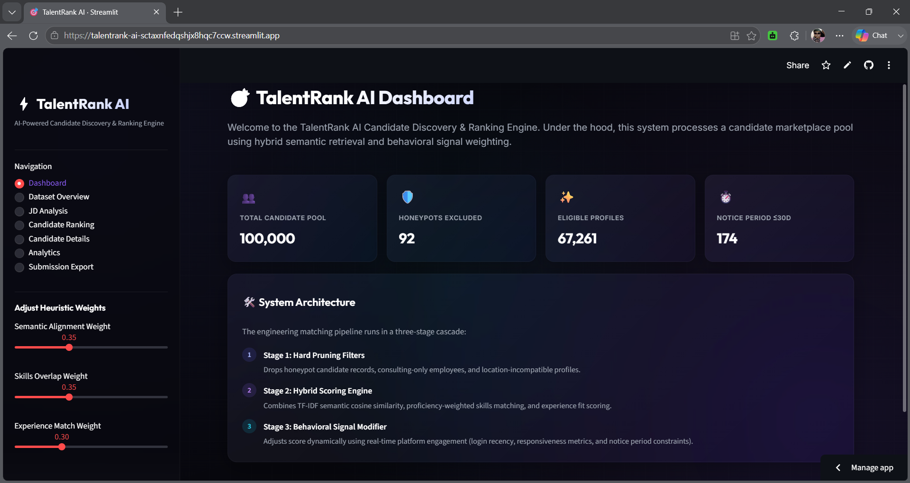
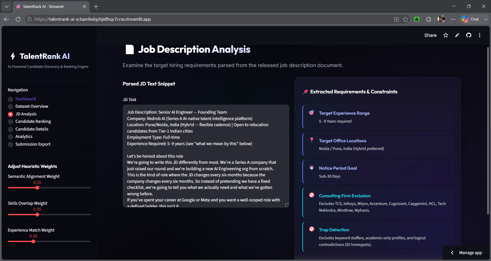
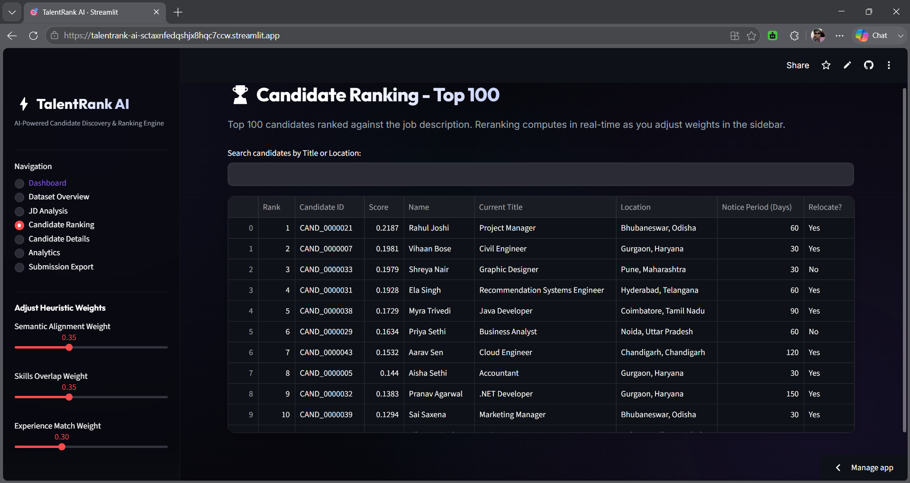
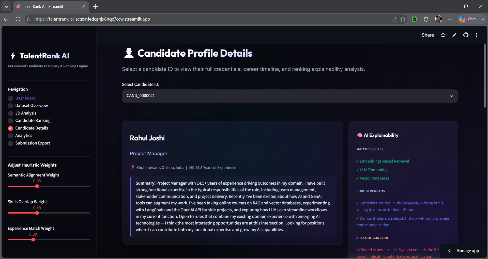
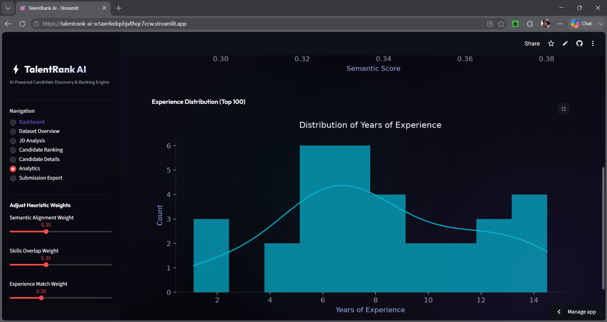
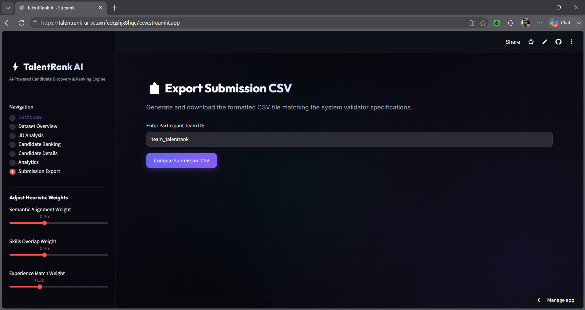

# TalentRank AI

## AI-Powered Candidate Discovery & Ranking Engine

[](https://www.python.org/)
[](https://streamlit.io/)
[](https://scikit-learn.org/)
[](https://pandas.pydata.org/)
[](https://numpy.org/)
[](LICENSE)
[](https://github.com/priya011006/TalentRank-AI)

---

## 🔗 Live Demo

Experience the application in action:  
**[https://talentrank-ai-sctaxnfedqshjx8hqc7ccw.streamlit.app/](https://talentrank-ai-sctaxnfedqshjx8hqc7ccw.streamlit.app/)**

---

## 📂 GitHub Repository

**[https://github.com/priya011006/TalentRank-AI](https://github.com/priya011006/TalentRank-AI)**

---

## 📖 Project Overview

TalentRank AI is a production-grade candidate discovery, matching, and ranking engine built to evaluate massive candidate pools against specific hiring requirements in real-time. The system implements a high-performance cascade pipeline that cleans, filters, scores, and explains candidate recommendations under strict CPU-only and local compute constraints.

---

## 🎯 Problem Statement

Recruiters face several key challenges when evaluating large candidate pools:
- Manual review of thousands of profiles is time-consuming and inconsistent
- Identifying fraudulent or contradictory profiles (honeypots) is error-prone
- Balancing technical skills, experience, and behavioral signals is complex
- Scoring systems often lack transparency and explainability

---

## 💡 Solution

TalentRank AI addresses these challenges with a three-stage cascade pipeline that:
1. Prunes invalid and low-quality profiles quickly
2. Computes hybrid semantic and feature-based scores
3. Adjusts final rankings using behavioral signals
4. Generates explainable recommendations with human-readable justifications

---

## ✨ Key Features

- **Hybrid Ranking**: Combines semantic similarity, skill matching, experience fit, and behavioral signals
- **Semantic Search**: Uses TF-IDF and cosine similarity for text-based candidate matching
- **Explainable AI (XAI)**: Generates human-readable justifications for each ranking
- **Behavioral Signals**: Incorporates login recency, response rates, and interview attendance
- **Candidate Validation**: JSON Schema validation for profile data integrity
- **Honeypot Detection**: Automatically identifies fraudulent profiles with contradictions
- **CPU-Efficient Pipeline**: Optimized for real-time performance without GPU dependencies
- **Deterministic Ranking**: Reproducible results with configurable weights
- **Interactive Dashboard**: Streamlit-based UI with real-time weight adjustment
- **Submission Generation**: Exports validated CSV files matching required specifications

---

## 🏗️ System Architecture

```text
Job Description
│
▼
JD Parser
│
▼
Candidate Loader
│
▼
Schema Validation
│
▼
Honeypot Detection
│
▼
Hard Pruning
│
▼
Feature Engineering
│
▼
Semantic Matching
│
▼
Hybrid Ranking Engine
│
▼
Explainability
│
▼
Top Ranked Candidates
│
▼
Submission CSV
```

---

## � Application Preview

### Dashboard
  
Overview of the talent pool with key metrics and system architecture.

### Job Description Analysis
  
Extracts and visualizes hiring requirements from the uploaded job description.

### Candidate Ranking
  
Interactive table of top 100 ranked candidates with search and filtering.

### Candidate Profile & Explainability
  
Deep dive into individual candidate profiles with AI-powered explainability.

### Analytics Dashboard
  
Visualizes score distributions and candidate demographics for the top 100.

### Submission Export
  
Generates and downloads validated CSV files for submission.

---

## 🛠️ Tech Stack

| Category        | Technologies                                                                 |
|-----------------|------------------------------------------------------------------------------|
| **Language**    | Python 3.10+                                                                 |
| **Framework**   | Streamlit                                                                    |
| **Libraries**   | Pandas, NumPy, Scikit-learn, Matplotlib, Seaborn, python-docx, jsonschema   |
| **Deployment**  | Streamlit Community Cloud                                                    |
| **Testing**     | pytest                                                                       |
| **Validation**  | JSON Schema                                                                  |
| **NLP**         | TF-IDF Vectorizer, Cosine Similarity                                         |
| **Visualization** | Matplotlib, Seaborn                                                          |
| **Version Control** | Git, GitHub                                                               |

---

## 📁 Project Structure

```text
TalentRank-AI/
├── assets/                     # Application screenshots
├── backend/
│   ├── candidate_loader.py     # Line-by-line JSONL streaming loader
│   ├── candidate_parser.py     # Candidate profiles cleaner & normalizer
│   ├── jd_parser.py            # Word document parser (.docx)
│   ├── schema_validator.py     # jsonschema profile validator
│   └── submission_generator.py # Final CSV output formatter & validator
├── services/
│   ├── explainability.py       # AI explainability text generator
│   ├── feature_generator.py    # Feature computation (tenure, skills, experience)
│   ├── ranking_config.py       # Heuristic weights configuration defaults
│   └── ranking_engine.py       # Core scoring, filtering, and tie-breaking engine
├── frontend/
│   └── app.py                  # Recruiter dashboard UI (Streamlit)
├── tests/
│   ├── test_loader.py          # Loader and schema validation unit tests
│   ├── test_jd_intelligence.py # JD requirements extraction unit tests
│   ├── test_features.py        # Feature extraction unit tests
│   ├── test_ranking.py         # Core ranking rules unit tests
│   ├── test_explainability.py  # Explainability generator unit tests
│   ├── test_submission.py      # Output CSV formatting unit tests
│   └── test_integration.py     # End-to-end integration and honeypot tests
├── data/                       # Input datasets (job description, candidates)
├── outputs/                    # Generated submission files
├── requirements.txt            # Project library dependencies
├── config.py                   # Global file paths and hyperparameter constants
└── settings.py                 # UI styling and page configurations
```

---

## 🚀 Installation

### Prerequisites
- Python 3.10 or higher
- Windows / macOS / Linux

### Step 1: Clone the Repository
```bash
git clone https://github.com/priya011006/TalentRank-AI.git
cd TalentRank-AI
```

### Step 2: Create and Activate a Virtual Environment
```powershell
# Create environment
python -m venv .venv

# Activate on Windows (PowerShell)
.venv\Scripts\activate

# Activate on macOS/Linux
source .venv/bin/activate
```

### Step 3: Install Dependencies
```bash
pip install -r requirements.txt
```

---

## ▶️ Running the Project

### Launch the Application
```bash
streamlit run frontend/app.py
```
Open your browser and navigate to `http://localhost:8501`.

### Running Tests
```bash
python -m pytest
```
All unit and integration tests should pass successfully.

---

## 🌟 Engineering Highlights

- **Modular Architecture**: Clear separation of concerns across backend, services, and frontend
- **Streaming Data Loading**: Efficiently processes large datasets without loading everything into memory
- **Explainability First**: Every ranking decision comes with a human-readable justification
- **Scalability**: Designed to handle 100,000+ candidate profiles on standard hardware
- **CPU-Only Inference**: No GPU dependencies, making deployment simple and cost-effective
- **Maintainability**: Comprehensive test coverage and clean, well-documented code
- **Reproducible Rankings**: Deterministic scoring with configurable weights

---

## 🔮 Future Improvements

- **Sentence Transformers**: Replace TF-IDF with modern sentence embeddings for better semantic understanding
- **FAISS**: Integrate Facebook AI Similarity Search for faster nearest neighbor queries
- **Cross Encoder Reranking**: Improve ranking quality with cross-encoder models
- **Learning-to-Rank**: Implement machine learning-based ranking models
- **Vector Databases**: Add support for vector databases like Pinecone or Weaviate
- **Enterprise REST APIs**: Build scalable APIs for integration with HR systems
- **Docker**: Containerize the application for consistent deployments
- **AWS Deployment**: Deploy to AWS for production-grade scalability
- **Authentication**: Add user authentication and role-based access control
- **Advanced Recruiter Dashboards**: Build tailored dashboards for different recruiter roles

---

## 👤 Developer

**Priya Patel**  
B.Tech Computer Science  
Full Stack & AI Developer  

[GitHub](https://github.com/priya011006)  
